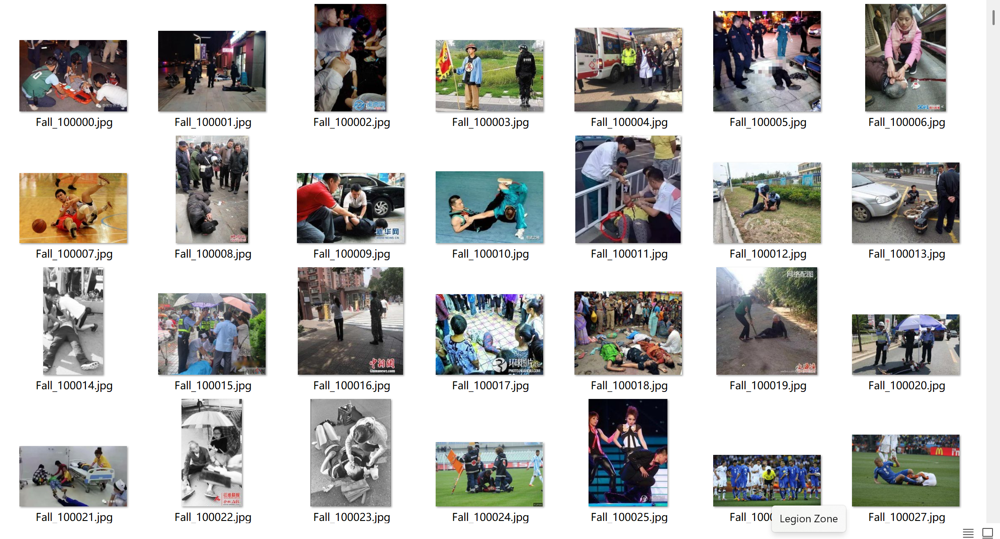
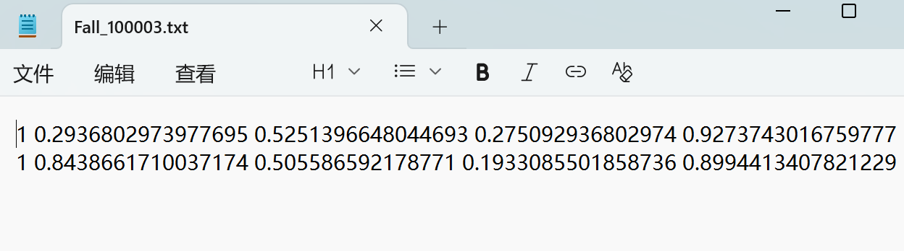
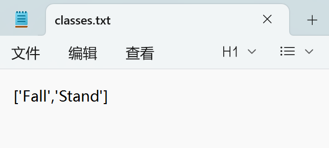
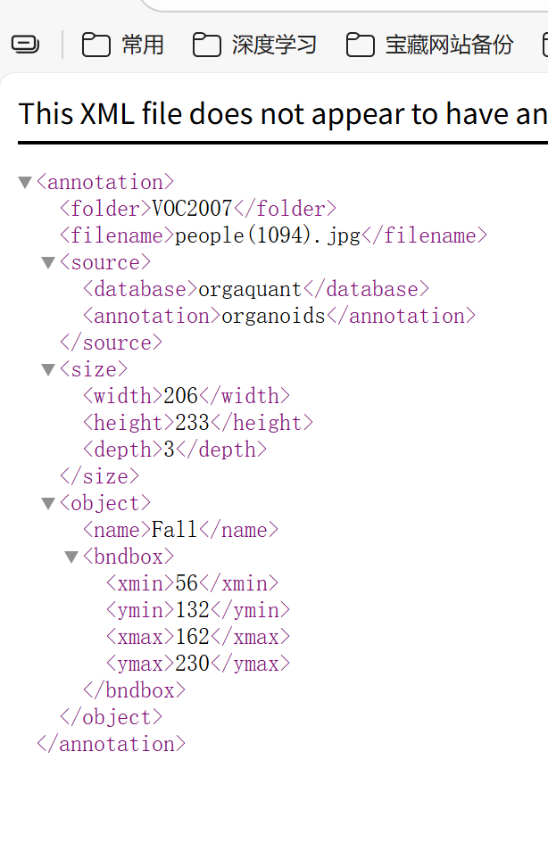
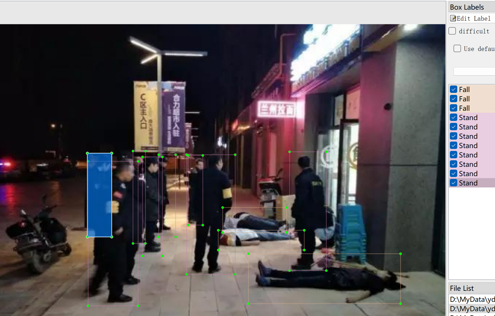

# Detection of Falling and Standing - Target Detection Dataset

Dataset Information Introduction: A total of 8,719 images are available along with their corresponding labeled files. The label files are formatted in two ways: VOC formatted as XML files and YOLO formatted as txt files.

- 'Fall'
- 'Stand'

The number of images and the number of bounding box labels per category are as follows: (the English labels are used for annotation, and the Chinese names provided in parentheses serve as references)

Note: An image may contain multiple objects, so the total number of bounding boxes might be greater than the total number of images.

The complete dataset consists of three folders and a txt file:
- all_images: Stores the dataset images. Screenshots are attached here:
- all_txt: And classes.txt: Stores the YOLO formatted txt labels, which have the same quantity as the images, with each label file corresponding to an image.
- classes.txt:
- all_xml: VOC formatted xml label files. They also have the same quantity as the images, with each label file corresponding to an image.

To view the detailed specifications of the VOC formatted standard files, please do your own research on Baidu.

Both formats can be used, choose one according to your preference.

Annotation screenshots:

## Images

Here is a pay link on Stripe ( https://buy.stripe.com/3cs8yP7sY87d0vu9AB ). Please contact me lonlonago@foxmail.com after funding $89, and I will send you a complete data files , thank you!

